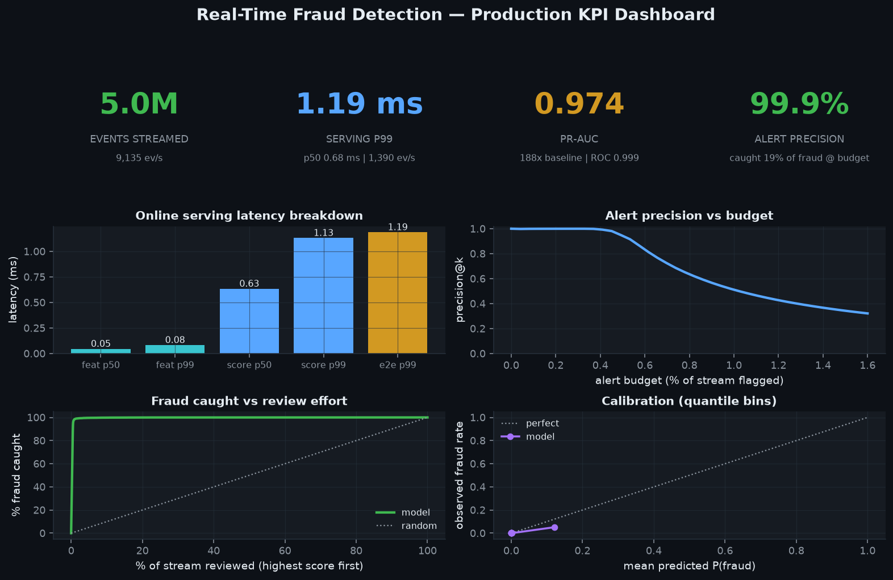
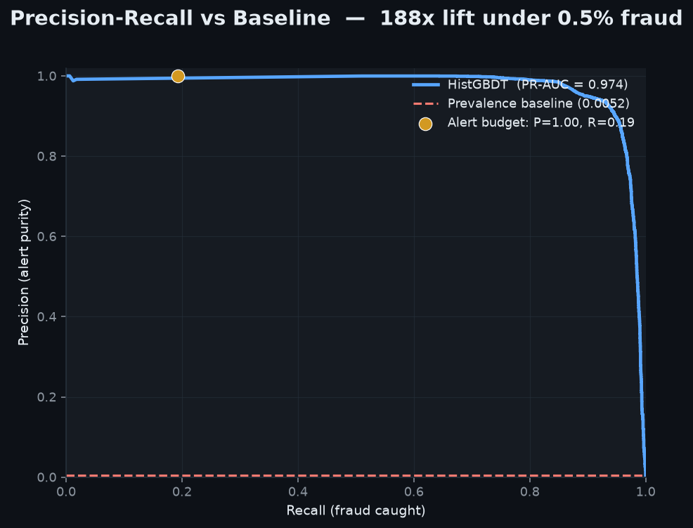
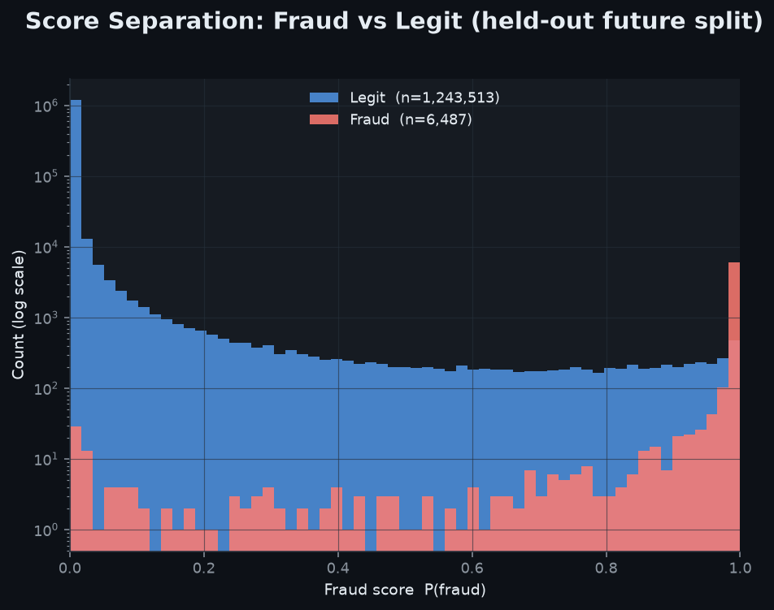
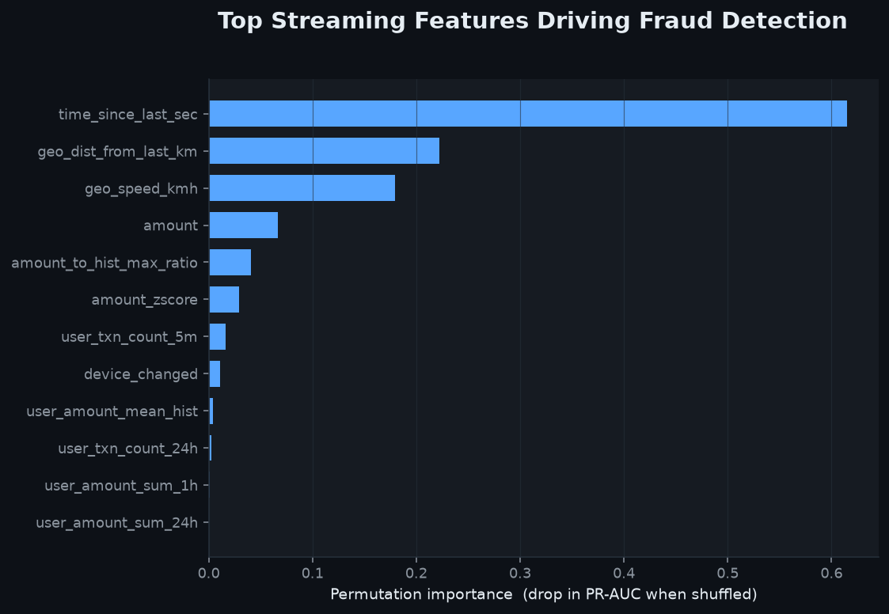

# Real-Time Fraud Detection

**Streaming feature engineering + sub-millisecond online serving for card fraud —
imbalanced, latency-critical, leakage-free.**

Card fraud must be scored **before** a transaction is authorized (single-digit
milliseconds), the signal lives in **per-entity temporal context** (how this user
is behaving *now* vs. their history), fraud is **rare** (~0.5%) and **bursty**, and
a single feature that peeks at the future collapses in production. This project
builds the whole path — a bounded-memory online feature store, a leak-free training
split, a calibrated model, and a measured serving benchmark.

Offline, deterministic (`seed=42`), zero paid APIs, CPU-only.

```
 TransactionStream ──► OnlineFeatureStore ──►  offline table (Parquet)  ──► HistGBDT
 (time-ordered gen,     (bounded per-entity      (chunked row groups,        (time split,
  bursty fraud)          ring buffers + LRU)      zstd, float32)              class weights)
        │                        │                                                │
        └──────────────► online serving ◄───────────────────────────────────────┘
                          features_for(event) + predict_proba → p50/p99 latency
```

The **same feature code** builds the offline table and serves online — no train/serve skew.

---

## Results (real numbers, from `make run`)

**Scale & ingest** — 5,000,000 events streamed through the online store:

| metric | value |
|--------|-------|
| Events streamed | **5,000,000** |
| Fraud rate | 0.493% (24,627 fraud) |
| Ingest throughput | 9,135 ev/s |
| Peak RSS | **1,066 MB** — bounded (60,000 tracked users), O(entities) not O(events) |

**Detection quality** — held-out *future* time split (train 3.75M / test 1.25M):

| metric | value |
|--------|-------|
| **PR-AUC** | **0.974** (baseline 0.0052 → **188× lift**) |
| ROC-AUC | 0.9993 |
| Alert precision @ 0.1% budget | **0.999** (1,249 / 1,250 alerts are true fraud) |

**Online serving latency** — single-event scoring, measured over 20,000 events:

| stage | p50 | p99 |
|-------|----:|----:|
| feature build | 0.045 ms | 0.082 ms |
| model score | 0.634 ms | 1.131 ms |
| **end-to-end** | 0.68 ms | **1.19 ms** |

Well inside a real-time budget (p99 **1.19 ms** ≪ 25 ms). Full numbers in
[`data/results.json`](data) (regenerated by `make run`).

---

## Project Document

- Prepared for **Sai Veda**
- Publishing account: **Nikeshk834**
- Full handoff note: [`PROJECT_DOCUMENT.pdf`](./PROJECT_DOCUMENT.pdf)

## Screenshots

Generated by `make screenshots` from the real run artifacts — no mock-ups.

### Production KPI dashboard


### Precision–Recall vs baseline


### Score distribution — fraud vs legit


### Permutation feature importance


---

## Why it scales to 1B events

The online store keeps, per entity, a `deque(maxlen=64)` ring buffer of recent
transactions plus a few running scalars; per-event work is an O(64) scan — a small
constant — and the number of tracked entities is capped with **LRU eviction**. So
**RSS is O(entities), not O(events)**: streaming 1B events costs the same memory as
1M. That makes a billion events a throughput/sharding problem (partition by entity
key across workers, à la Kafka/Flink), not a memory problem. See
[`ARCHITECTURE.md`](ARCHITECTURE.md).

---

## Quickstart

```bash
make setup        # deps (already in the portfolio stack)
make test         # 15 tests: no future leakage, rolling-aggregate correctness,
                  #            PR-AUC beats baseline, serving latency measured
make run          # stream 5M events → train → evaluate → measure serving latency
make screenshots  # render the four PNGs into assets/
```

## Tests

`make test` asserts behavior, not smoke: the online store computes each feature
from **past-only** state (an ordering test *and* a brute-force recompute that only
looks at `ts < ts_i`), rolling aggregates match a hand-computed fixture, PR-AUC
beats the prevalence baseline, and single-event serving stays under budget with
throughput measured.

---

## Repo layout

```
05-realtime-fraud-detection/
├── src/fraud/          generator · features · pipeline · model · serving · metrics · schema · viztheme
├── tests/              no-leakage · rolling-aggregate · model · latency
├── scripts/            generate_data.py · run_pipeline.py · make_screenshots.py
├── benchmarks/         scaling_bench.py (bounded-memory throughput at scale)
├── assets/             four generated PNG screenshots (committed)
├── ARCHITECTURE.md     streaming, leakage-safety, and 1B scaling design
└── Makefile · requirements.txt · .gitignore
```
